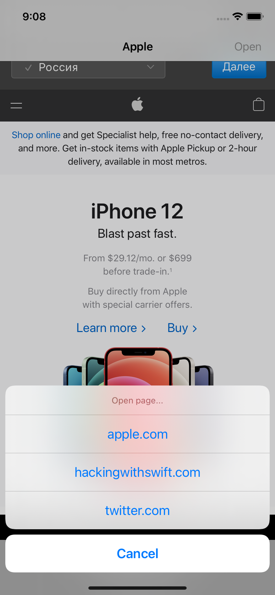
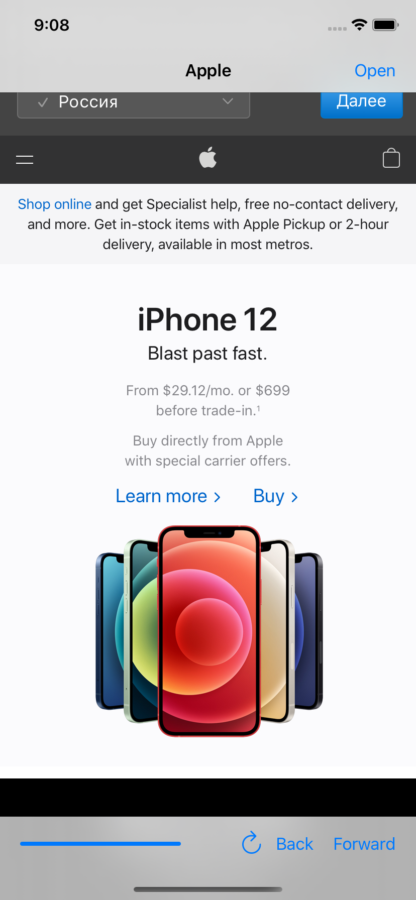
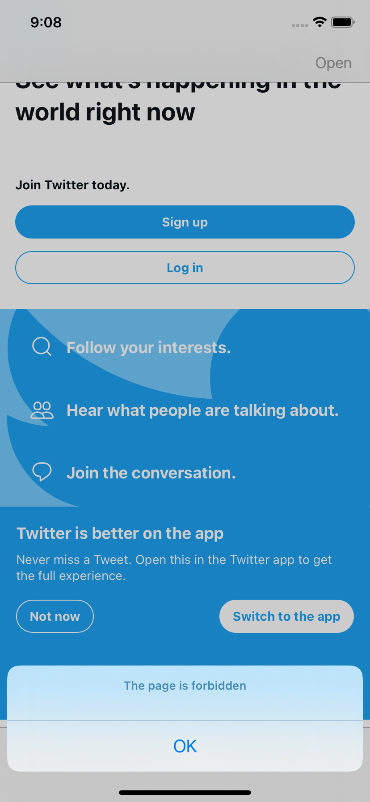

# Easy-Browser

## Description

Simple Browser application implemented using Web Kit. The app lets user choose a website in the list and navigate to it:

The application has buttons that allow user to switch back and forward between visited web pages.

If user taps on a link that navigates to another website other that exist in the list above, the app will display an error:

